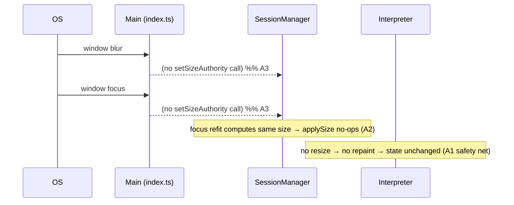
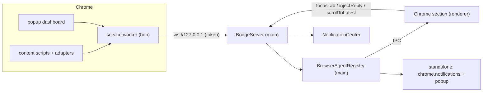

# Design Document

## Overview

This design delivers two bundled bodies of work:

- **Part A — State-detection stability (flicker fix).** Stop focus-change-induced PTY repaints from
  being interpreted as agent activity, so the status no longer bounces `completed ↔ working` when the
  user tabs between AgentWatch and other apps. Three coordinated changes: a *resize-grace window* in
  the interpreter, *sticky size authority* + *idempotent resize* in the session manager, and removing
  the focus/blur size churn in the main process.

- **Part B — Browser bonding.** A local, server-less bridge between the desktop app and a new Chrome
  MV3 extension ("AgentWatch Web"). The extension watches browser agents standalone; when the app is
  running it streams watched-tab state to the app, which renders a live "Chrome section" with
  click-to-jump and an opt-in reply-back. Strictly additive — neither side changes how any agent
  behaves, and the desktop CLI experience is untouched when no extension is connected.

The two parts are independent at the code level and will be sequenced so Part A (low-risk, immediately
useful) lands and is verified before Part B's larger surface.

---

## Architecture

The two parts are independent at the code level:

- **Part A** modifies the existing pipeline `PTY → SessionManager (tee) → Interpreter → SessionSink →
  renderer/notifications`. No new modules; it changes *when* output counts as activity and *when* a PTY
  is resized.
- **Part B** adds, alongside the existing `SessionManager`, a new `BridgeServer` (loopback WebSocket)
  and a `BrowserAgentRegistry` in the main process, new IPC channels + a renderer "Chrome section", and
  a separate Chrome MV3 extension sub-project (`agentwatch-web/`). The bridge is purely additive: when
  it is absent, the desktop app behaves exactly as today.

The per-part data-flow diagrams appear in their respective subsections under Components and Interfaces.

## Components and Interfaces

### Part A — State-detection stability

### Root cause (confirmed in code)

State is inferred purely from output *activity* (`Interpreter.feed` → `working`; `tick` → `completed`
after `quietMs`). Full-screen agent TUIs repaint their whole UI on PTY resize (SIGWINCH). Focus
changes trigger resizes from three places:

1. `src/main/index.ts` — `win.on("focus")` → `setSizeAuthority("gui")` and `win.on("blur")` →
   `setSizeAuthority(null)`; each renegotiates and resizes every session.
2. `src/main/sessionManager.ts` — `setSizeAuthority()` / `setViewerSize()` → `applySize()` →
   `pty.resize()`, with blur dropping to the MIN-across-viewers size (a genuinely different size when
   a native relay is attached), so the size really changes back and forth.
3. `src/renderer/src/components/TerminalsLayer.tsx` — `window.addEventListener("focus", refit)` →
   `onGuiSize` → `IPC.sessionResize` → `setViewerSize` → another `applySize`.

Each resize → full repaint → `feed()` sees a large burst → `working`; ~700 ms later → `completed`.
Every `completed` while unfocused also re-fires `notifyReady`.

### Design

Defense in depth — any one of these breaks the loop; together they make it robust.

#### A1. Resize-grace window in the `Interpreter`

Add a lightweight signal so the interpreter knows a burst is a repaint, not agent work.

- New private fields: `lastResizeAt = 0` and a configurable `resizeGraceMs` (default ~400 ms,
  overridable via `AGENTWATCH_RESIZE_GRACE_MS` and `InterpreterOptions`).
- New public method `noteResize(): void` that sets `lastResizeAt = Date.now()`.
- In `feed(chunk)`: still update `buffer` and run the **permission regex** (a real prompt right after
  a resize must still be caught). But gate the **activity bookkeeping**: WHEN
  `Date.now() - lastResizeAt < resizeGraceMs`, do **not** update `lastOutputAt`, do **not** accumulate
  `workBytes`, and do **not** transition `idle`/`completed` → `working`. The repaint is effectively
  invisible to the activity machine.
- Genuine work that continues past the grace window resumes normal detection (output keeps arriving),
  so R1.4 (no suppression of real activity) holds. A grace of ~400 ms is far shorter than a real
  generation and only spans the repaint burst.

Rationale: this is the single most important change. Even if a stray resize slips through A2/A3, the
interpreter refuses to treat the repaint as work.

#### A2. Session manager: sticky authority + idempotent resize + grace notification

In `src/main/sessionManager.ts`:

- **Idempotent `applySize`.** Track the last-applied `{cols, rows}` per `Session`
  (`session.appliedSize`). `applySize` computes the negotiated size and **returns early without calling
  `pty.resize` or `sink.onSize` if it equals the last applied size**. This satisfies R2.2/R2.4 — a
  focus refit that computes the same size is a true no-op.
- **Notify the interpreter on every real resize.** When `applySize` actually resizes, call
  `session.interpreter.noteResize()` immediately before `pty.resize(...)`, so the imminent repaint is
  covered by the grace window (wires A1 to the only place PTYs are resized).
- **Sticky size authority.** Keep authority semantics but make them stable across focus: the GUI
  remains the authority once attached; we stop dropping to `null` (MIN) merely because the window
  blurred. Authority is cleared only when the window is actually closed (`win.on("closed")` already
  calls `setSizeAuthority(null)`). This removes the back-and-forth size change that caused real
  repaints (R2.1/R2.3).

#### A3. Main process: don't resize on mere focus

In `src/main/index.ts`:

- Remove the `setSizeAuthority` calls from `win.on("focus")` and `win.on("blur")`. Set authority to
  `"gui"` once when the window is created/shown (e.g. in `ready-to-show` or `createWindow`), and clear
  it on `closed` (unchanged). Keep `windowFocused` tracking for the notification gate.
- Net effect: focus/blur no longer renegotiates PTY size at all.

#### A4. Renderer refit guard

In `src/renderer/src/components/TerminalsLayer.tsx`:

- Keep refit on real `resize`/`ResizeObserver` events, but in the `window "focus"` path only call
  `onGuiSize` when `manager.fit` reports a size that differs from the last reported size for that
  session (the manager can return the computed size; compare against a ref). Combined with A2's
  idempotent `applySize`, this guarantees focus alone never triggers a PTY resize.

#### A5. Notification correctness

With A1–A4, repaints no longer produce spurious `working → completed` transitions, so
`notifyReady` (fired in the `onState` sink in `index.ts` when `state === "completed" && !windowFocused`)
naturally fires only on a genuine edge — `Interpreter.setState` already short-circuits when the state
is unchanged. No additional dedupe logic is required; we add a regression test to prove R3.4.

### Part A — sequence (focus away then back, no agent activity)



---

### Part B — Browser bonding

### Architecture



The extension is fully functional with no bridge (standalone). The bridge is an additional consumer of
the same content-script state.

#### B0. Transport decision

The plan prefers **Chrome Native Messaging**, with a **loopback WebSocket** fallback. Native messaging
requires Chrome to spawn a host executable and a registered host manifest, which is environment- and
install-specific. For this implementation:

- **Implemented now:** loopback WebSocket on `127.0.0.1` with a token handshake. It is fully
  in-repo testable, server-less (no third party), and satisfies all bridge requirements.
- **Designed, deferred:** a native-messaging host stub that relays stdio↔the running app over the same
  local socket. The bridge message contract is transport-agnostic, so adding it later is additive.

This is a deliberate scoping call (flagged in the spec): WebSocket first, native messaging as a later
phase.

#### Transport & security details

- Port: fixed default `8731` with a small fallback scan (`8731–8740`) if occupied; the chosen port is
  written to `chrome.storage`-discoverable means via the extension trying the range. (Documented limit:
  no remote discovery; the extension probes the localhost range.)
- Origin allowlist: the WS server accepts connections only from `chrome-extension://<our-id>` origins.
- Pairing token: on first connect the app generates a token and surfaces a short pairing code in the
  "Add the Chrome extension" flow; the extension must present it in `bridge:hello`. The server rejects
  handshakes without a valid token.

**Validates: Requirements 4.3**
- Binds to `127.0.0.1` only; never `0.0.0.0`. No data egress (R4.6).

#### B1. `BridgeServer` (main process)

New file `src/main/bridge/bridgeServer.ts`, modeled on `IpcServer`:

- Owns a `ws` server on loopback. Manages connected clients (typically one extension SW).
- Parses inbound JSON messages against the contract; ignores malformed/unknown (R5.5).
- Holds a reference to a new `BrowserAgentRegistry` and to `NotificationCenter`.
- Exposes `focusTab(tabId)`, `scrollToLatest(tabId)`, `injectReply(tabId, text)` that send app→ext
  messages.
- `start()` / `shutdown()` lifecycle; instantiated in `app.whenReady` next to `ipcServer`, and closed
  in `before-quit` / `window-all-closed` (R4.5).

#### B2. `BrowserAgentRegistry` (main process)

New file `src/main/bridge/browserAgents.ts`. Pure state holder, the browser analog of `SessionManager`
but read-only w.r.t. the tabs:

- `Map<number /*tabId*/, TrackedTab>`.
- `replaceSnapshot(list)` on `bridge:agents`; `applyState(tabId, state)` on `agent:state`;
  `applyCompleted(tabId, payload)` on `agent:completed`.
- Emits change events through a small sink the main process forwards to the renderer over new IPC
  channels, and triggers notifications on completion when the window is unfocused.
- Clears all tabs when the bridge disconnects (so the Chrome section hides — R6.2).

#### B3. Shared types (`src/shared/types.ts` additions)

```ts
export type BrowserAgentState = "idle" | "working" | "done";

export interface TrackedTab {
  tabId: number;
  windowId?: number;
  adapterId: string;     // "claude"
  label: string;         // "Claude"
  url?: string;
  favIconUrl?: string;
  state: BrowserAgentState;
  lastChange: number;
  snippet?: string;      // last completion snippet
  output?: string;       // optional fuller latest-message text
}
```

Bridge wire messages get a dedicated `src/shared/bridge.ts` (kept separate from the relay
`protocol.ts`):

```ts
export type BridgeInbound =       // extension -> app
  | { type: "bridge:hello"; version: string; adapters: string[]; token?: string }
  | { type: "bridge:agents"; agents: TrackedTab[] }
  | { type: "agent:state"; tabId: number; state: BrowserAgentState }
  | { type: "agent:completed"; tabId: number; label: string; snippet?: string; output?: string };

export type BridgeOutbound =      // app -> extension
  | { type: "bridge:hello-ack"; version: string; capabilities: string[] }
  | { type: "focusTab"; tabId: number }
  | { type: "scrollToLatest"; tabId: number }
  | { type: "injectReply"; tabId: number; text: string };
```

#### B4. New IPC channels (`src/shared/ipc.ts`)

- `browserList` (main→renderer): full `TrackedTab[]` snapshot + a `connected: boolean` flag.
- `browserState` (main→renderer): `{ tabId, state }`.
- `browserCompleted` (main→renderer): `{ tabId, snippet, output }`.
- `browserFocus` (renderer→main): `tabId` → `bridge.focusTab` + `scrollToLatest`.
- `browserReply` (renderer→main): `{ tabId, text }` → `bridge.injectReply`.
- `bridgeStatus` (main→renderer): `{ connected, pairingCode? }` for the connection indicator + install flow.

Add matching methods to the preload `api` object and `index.d.ts` (mirrors existing patterns).

#### B5. Desktop "Chrome section" (renderer)

- New store `src/renderer/src/store/browserAgents.ts` (zustand), holding `connected`, `tabs[]`, keyed
  by `tabId`, with `setSnapshot`, `applyState`, `applyCompleted`.
- New component `src/renderer/src/components/ChromeSection.tsx`, rendered in `App.tsx`/`Sidebar.tsx`
  **only when `connected`** (R6.2). Each tab → a card (favicon, label, state pill, `Done ✓` badge +
  snippet/output, "go to" action, and an opt-in reply box when `done` and bonded).
- Reuses the existing token system / state palette from `theme.ts`/`styles.css` (R6.6) — working=amber,
  done=green, idle=neutral.

#### B6. Reply-back (the one sanctioned write)

- Reply box appears only for `done` tabs in bonded mode (R7.1/R7.4), clearly labeled as writing into
  the page (R7.5).
- Submit → `IPC.browserReply` → `bridge.injectReply(tabId, text)` → content script types into the
  composer and submits. Never automatic (R7.3).

#### B7. The extension sub-project (`agentwatch-web/`)

Per plan §11, with bonding additions. Structure:

```
agentwatch-web/
├─ manifest.json                 # MV3, least-privilege host_permissions (registry domains only)
├─ vite.config.ts                # Vite + CRXJS
├─ src/
│  ├─ background/index.ts        # SW: notifications, jump-to-tab, badge, bridge client
│  ├─ background/store.ts        # chrome.storage state + history
│  ├─ background/bridge.ts       # connects to ws://127.0.0.1, hello/token, relays state
│  ├─ content/index.ts           # picks adapter for host, boots watcher, SPA route re-resolve
│  ├─ content/watcher.ts         # MutationObserver busy→idle state machine
│  ├─ content/adapters/{types,registry,generic,claude,chatgpt,gemini,perplexity,copilot,grok}.ts
│  ├─ popup/{index.html,main.ts} # minimal dashboard
│  └─ shared/{messages,constants}.ts
└─ icons/
```

- **Watcher** (`content/watcher.ts`): busy via adapter `busySelector` (the Stop control) else mutation
  quiescence; fire `completed` only on busy→idle edge, once per generation (R8.1/R8.2). Debounce in the
  content script (lives as long as the page), never in the SW (R8.6).
- **Adapters** (R9): Claude reference adapter first + generic fallback; Tier-1 set
  (Claude/ChatGPT/Gemini/Perplexity/Copilot/Grok) for v1; tiny, fixture-testable; degrade to generic on
  selector drift (R8.7).
- **Service worker** (R8.3–R8.6): notifications titled "<Agent> finished" + snippet; `onClicked` →
  focus window+tab + `scrollToLatest`; toolbar badge; rebuild from heartbeats after SW restart.
- **Bridge client** (`background/bridge.ts`): connect to the app, `bridge:hello` (version, adapters,
  token), stream `bridge:agents`/`agent:state`/`agent:completed`; handle `focusTab`/`scrollToLatest`/
  `injectReply`; silently fall back to standalone if no app (Non-functional #1).
- `chrome.tabs` only in SW/popup, never content (Non-functional #4).

#### B8. Install/download through the app

- An "Add the Chrome extension" affordance in the desktop app (e.g. in `SettingsModal`) that opens the
  Web Store listing or loads the unpacked build from the app's `resources/`, and shows the pairing code
  (R10.1). Native-messaging host manifest install is part of the deferred native-messaging phase.

---

## Data Models

- **Existing, unchanged:** `SessionInfo`, `AgentState`, `PendingPermission`, `FeedEvent`, `AppSettings`.
- **New:** `BrowserAgentState`, `TrackedTab` (shared); `BridgeInbound`/`BridgeOutbound` (bridge wire);
  `Interpreter.resizeGraceMs`/`lastResizeAt` (internal); `Session.appliedSize` (internal).

## Error Handling

- Interpreter: all new logic stays inside the existing `try/catch` in `feed`; interpretation must never
  break the mirror.
- Bridge: malformed/unknown messages are ignored; a bridge crash must never affect CLI sessions
  (isolated module, guarded handlers). WS errors close the client and clear the registry → Chrome
  section hides cleanly.
- Extension: a failing adapter degrades to generic quiescence; the content script never writes to the
  page except scroll-on-jump and the explicit reply-back.

## Correctness Properties

These invariants must hold for the implementation to be considered correct; each is testable.

### Property 1: No focus-driven state change

For any sequence of focus/blur events with no agent output, every session's `AgentState` is unchanged.

**Validates: Requirements 1.1, 1.5**

### Property 2: Repaints are inert

Output arriving within `resizeGraceMs` of a `noteResize()` never causes an `idle`/`completed` → `working` transition and never extends a work burst.

**Validates: Requirements 1.2, 1.3**

### Property 3: Real activity preserved

Output arriving outside the grace window still drives `working` and a subsequent busy→idle `completed`.

**Validates: Requirements 1.4**

### Property 4: Idempotent resize

`applySize` issues `pty.resize`/`onSize` only when the negotiated size differs from the last applied size.

**Validates: Requirements 2.2, 2.4**

### Property 5: One notification per edge

At most one "ready" notification fires per genuine `working → completed` transition while unfocused.

**Validates: Requirements 3.4**

### Property 6: Additive bonding

With the bridge disconnected, the Chrome section is absent and the CLI dashboard, notifications, and sizing are unchanged. 

**Validates: Requirements 6.2**

### Property 7: Read-only default

No app→extension write message (`injectReply`) is ever sent without an explicit user submit in bonded mode.

**Validates: Requirements 7.3**

### Property 8: Graceful malformed input

Unknown/malformed bridge messages are ignored and never affect CLI sessions.

**Validates: Requirements 5.5**

### Property 9: No egress

Neither product opens a non-loopback network connection or transmits user data off-machine. 

**Validates: Requirements 4.6, 10.4**

## Testing Strategy

- **Part A (unit, main):** extend `Interpreter` tests — a resize-grace burst does not flip
  `completed`/`idle` to `working`; genuine post-grace output still detects `working`→`completed`;
  `applySize` is idempotent for equal sizes; focus with no size change issues no `pty.resize`. Add a
  scenario to `scripts/scenarios-test.mjs` simulating resize bursts.
- **Part A (manual):** run a Gemini/Claude TUI, tab to VS Code and back repeatedly → state stays put,
  no duplicate "ready" toasts.
- **Part B (unit):** `BrowserAgentRegistry` snapshot/state/completed transitions; bridge message
  parsing (valid/malformed); registry clears on disconnect.
- **Part B (extension):** adapter fixtures (saved DOM) for busy→idle edge per Tier-1 site; watcher
  edge-fires once; SW restart rebuilds from heartbeats.
- **Part B (integration):** extension ↔ app handshake over loopback WS with token; completion appears
  as a card; click focuses the tab; reply injects into the composer.
- Run the existing `npm` build/typecheck and `scripts/selfcheck.mjs` after each part.

## Sequencing (maps to tasks.md)

1. **Part A** — interpreter resize-grace, session-manager idempotent resize + sticky authority, main
   focus handlers, renderer refit guard, tests. Ship & verify first.
2. **Part B core (app side)** — shared types, bridge server (WS + token), registry, IPC channels,
   preload, Chrome section UI + store, notifications on browser completion.
3. **Part B extension** — scaffold, Claude adapter + watcher + generic fallback, SW notify/jump,
   popup, bridge client (bonded mode), remaining Tier-1 adapters.
4. **Part B reply-back + install flow** — opt-in reply UI + `injectReply`; "Add the Chrome extension"
   flow + pairing code.
