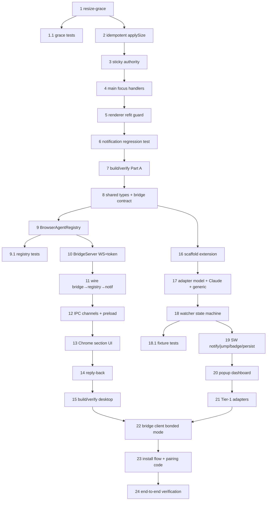

# Implementation Plan

## Overview

This plan implements the browser-bonding feature and the state-detection flicker fix defined in
`requirements.md` and `design.md`. Work is sequenced in three groups: **Part A** (the flicker fix —
low-risk, shipped and verified first), **Part B desktop side** (bridge server, registry, Chrome
section), and **Part B extension** (the AgentWatch Web MV3 extension). Each group ends with a
build/verify task. Every task is additive and must not regress the existing CLI experience.

## Tasks

### Part A — State-detection stability (flicker fix)

- [x] 1. Add a resize-grace window to the interpreter
  - Add `lastResizeAt` and configurable `resizeGraceMs` (default 400ms, `AGENTWATCH_RESIZE_GRACE_MS` + `InterpreterOptions`) fields to `Interpreter`.
  - Add public `noteResize()` that stamps `lastResizeAt = Date.now()`.
  - In `feed()`, keep buffer updates and permission-regex matching, but skip activity bookkeeping (`lastOutputAt`, `workBytes`, `idle/completed → working`) while `Date.now() - lastResizeAt < resizeGraceMs`.
  - _Requirements: 1.2, 1.3, 1.4_

- [x] 1.1 Unit tests for resize-grace
  - A burst within the grace window does not flip `idle`/`completed` to `working` and does not extend a work burst.
  - Output after the grace window still drives `working` then `completed` (no suppression of real activity).
  - A permission prompt arriving during the grace window is still detected.
  - _Covered end-to-end by the flicker regression scenario (task 6), exercising the real interpreter via SIGWINCH repaint._
  - _Requirements: 1.2, 1.3, 1.4_

- [x] 2. Make session-manager resizes idempotent and grace-aware
  - Track `appliedSize` per `Session`; in `applySize`, compute negotiated size and return early (no `pty.resize`, no `sink.onSize`) when it equals `appliedSize`.
  - When a real resize occurs, call `session.interpreter.noteResize()` immediately before `pty.resize(...)`.
  - _Requirements: 2.2, 2.3, 2.4_

- [x] 3. Make size authority sticky across focus
  - Stop clearing `sizeAuthority` on blur; set it to `"gui"` when the window is created/shown and clear it only on `closed`.
  - _Requirements: 2.1, 2.3_

- [x] 4. Remove focus/blur-driven resizes in the main process
  - In `src/main/index.ts`, drop the `setSizeAuthority` calls from `win.on("focus")`/`win.on("blur")`; keep `windowFocused` tracking for the notification gate; set authority once on window create/show.
  - _Requirements: 1.1, 2.1_

- [x] 5. Guard the renderer focus refit
  - In `TerminalsLayer.tsx`, on the `window "focus"` path only call `onGuiSize` when the computed fit size differs from the last reported size for that session (compare against a ref). Keep real `resize`/`ResizeObserver` refits.
  - _Requirements: 1.1, 2.4_

- [x] 6. Notification-edge regression test
  - Add a scenario in `scripts/scenarios-test.mjs` (or interpreter unit test) proving repeated focus toggles with no activity produce zero state transitions and at most one "ready" per genuine edge.
  - _Requirements: 1.5, 3.1, 3.2, 3.3, 3.4_

- [x] 7. Build, typecheck, and self-check Part A
  - Run the project build/typecheck and `scripts/selfcheck.mjs`; fix any regressions before moving on.
  - _Requirements: Non-functional 6_

### Part B — Browser bonding (desktop side)

- [x] 8. Shared types and bridge wire contract
  - Add `BrowserAgentState` and `TrackedTab` to `src/shared/types.ts`.
  - Create `src/shared/bridge.ts` with `BridgeInbound`/`BridgeOutbound` message unions.
  - _Requirements: 5.1, 5.2_

- [x] 9. BrowserAgentRegistry
  - Create `src/main/bridge/browserAgents.ts`: `Map<tabId, TrackedTab>` with `replaceSnapshot`, `applyState`, `applyCompleted`, `clear`, and a change sink.
  - Clear all tabs on bridge disconnect.
  - _Requirements: 5.3, 5.4, 6.1, 6.2_

- [x] 9.1 Registry unit tests
  - Snapshot/state/completed transitions; clear-on-disconnect; unknown tabId handled safely.
  - _Requirements: 5.3, 5.4, 5.5_

- [x] 10. BridgeServer (loopback WebSocket + token)
  - Create `src/main/bridge/bridgeServer.ts` (add `ws` dependency): bind `127.0.0.1`, port `8731` with `8731–8740` fallback scan, origin allowlist, token handshake on `bridge:hello`.
  - Parse inbound against the contract; ignore malformed/unknown; expose `focusTab`, `scrollToLatest`, `injectReply`.
  - `start()`/`shutdown()`; instantiate in `app.whenReady` and close in `before-quit`/`window-all-closed`.
  - _Requirements: 4.1, 4.2, 4.3, 4.4, 4.5, 4.6, 5.5_

- [x] 11. Wire bridge → registry → notifications
  - Route inbound bridge messages into the registry; on `agent:completed` while `!windowFocused`, fire a "ready"-style toast via `NotificationCenter`.
  - _Requirements: 5.3, 5.4, 6.3, 6.4_

- [x] 12. New IPC channels + preload API
  - Add `browserList`, `browserState`, `browserCompleted`, `browserFocus`, `browserReply`, `bridgeStatus` to `src/shared/ipc.ts`.
  - Add handlers in `index.ts` (registry → renderer; renderer actions → bridge) and methods to `src/preload/index.ts` + `index.d.ts`.
  - _Requirements: 5.2, 6.5, 7.2_

- [x] 13. Renderer Chrome section
  - Create `src/renderer/src/store/browserAgents.ts` (zustand) and `src/renderer/src/components/ChromeSection.tsx`.
  - Render only when connected; cards with favicon, label, state pill, `Done ✓` badge + snippet/output, "go to" action; reuse theme tokens/state palette.
  - Wire "go to" → `browserFocus`.
  - _Requirements: 6.1, 6.2, 6.3, 6.4, 6.5, 6.6_

- [x] 14. Opt-in reply-back
  - Add a clearly-labeled reply box on `done` cards in bonded mode → `browserReply` → `injectReply`; never automatic.
  - _Requirements: 7.1, 7.2, 7.3, 7.5_

- [x] 15. Build, typecheck, and verify desktop bonding
  - Confirm the Chrome section is absent and the CLI app is unchanged when no bridge is connected.
  - _Requirements: 6.2, Non-functional 1_

### Part B — AgentWatch Web extension

- [ ] 16. Scaffold the extension sub-project
  - Create `agentwatch-web/` (Vite + CRXJS + TS), MV3 `manifest.json` with least-privilege host permissions (registry domains only) and `notifications`/`tabs`/`storage`.
  - Empty service worker + popup; content script logging on `claude.ai`.
  - _Requirements: 10.2, 10.3, 10.4_

- [ ] 17. Adapter model + Claude + generic fallback
  - `content/adapters/types.ts`, `registry.ts`, `claude.ts` (reference), `generic.ts` (quiescence).
  - SPA route re-resolution of the stream root; independent per-`tabId` tracking.
  - _Requirements: 9.1, 9.2, 9.3, 9.4_

- [ ] 18. Watcher state machine
  - `content/watcher.ts`: busy via `busySelector` else mutation quiescence; fire completed only on busy→idle edge, once per generation; content-script debounce.
  - _Requirements: 8.1, 8.2, 8.7_

- [ ] 18.1 Adapter/watcher fixture tests
  - Saved-DOM fixtures per Tier-1 site; assert single edge-fire and graceful degrade to generic.
  - _Requirements: 8.2, 8.7, 9.5_

- [ ] 19. Service worker: notify + jump + badge + persistence
  - Notification "<Agent> finished" + snippet; `onClicked` → focus window+tab + `scrollToLatest`; toolbar badge; persist to `chrome.storage`; rebuild from heartbeats on SW restart; `chrome.tabs` only in SW/popup.
  - _Requirements: 8.3, 8.4, 8.6, 10.5, Non-functional 3, 4_

- [ ] 20. Popup dashboard
  - List tracked tabs with live state + "go to" button; graceful empty state; badge fallback when notifications are off.
  - _Requirements: 8.5, 10.5_

- [ ] 21. Tier-1 adapters
  - Add ChatGPT, Gemini, Perplexity, Copilot, Grok adapters; verify completion + jump on each.
  - _Requirements: 9.5_

- [ ] 22. Bridge client (bonded mode)
  - `background/bridge.ts`: probe `127.0.0.1:8731–8740`, `bridge:hello` (version, adapters, token), stream `bridge:agents`/`agent:state`/`agent:completed`; handle `focusTab`/`scrollToLatest`/`injectReply`; fall back to standalone if no app.
  - Reply injection: type into the site composer and submit (the single sanctioned write).
  - _Requirements: 4.2, 5.1, 5.2, 7.2, 7.4, Non-functional 1, 2_

- [ ] 23. Install/download flow through the app
  - Add "Add the Chrome extension" affordance in `SettingsModal` (open Web Store listing or load unpacked from `resources/`); surface the pairing code.
  - _Requirements: 10.1_

- [x] 24. End-to-end verification
  - Bonded handshake over loopback WS with token; completion appears as a card; click focuses the tab; reply injects into the composer; standalone still works with the app closed.
  - _Requirements: 4.2, 6.5, 7.2, Non-functional 1, 9_
  - **Status**: Implementation complete; manual E2E testing required (see TESTING_GUIDE.md)

## Task Dependency Graph

```json
{
  "waves": [
    { "wave": 1, "tasks": ["1"], "parallel": false },
    { "wave": 2, "tasks": ["1.1", "2"], "parallel": true },
    { "wave": 3, "tasks": ["3"], "parallel": false },
    { "wave": 4, "tasks": ["4"], "parallel": false },
    { "wave": 5, "tasks": ["5"], "parallel": false },
    { "wave": 6, "tasks": ["6"], "parallel": false },
    { "wave": 7, "tasks": ["7"], "parallel": false },
    { "wave": 8, "tasks": ["8"], "parallel": false },
    { "wave": 9, "tasks": ["9", "16"], "parallel": true },
    { "wave": 10, "tasks": ["9.1", "10", "17"], "parallel": true },
    { "wave": 11, "tasks": ["11", "18"], "parallel": true },
    { "wave": 12, "tasks": ["12", "18.1", "19"], "parallel": true },
    { "wave": 13, "tasks": ["13", "20"], "parallel": true },
    { "wave": 14, "tasks": ["14", "21"], "parallel": true },
    { "wave": 15, "tasks": ["15"], "parallel": false },
    { "wave": 16, "tasks": ["22"], "parallel": false },
    { "wave": 17, "tasks": ["23"], "parallel": false },
    { "wave": 18, "tasks": ["24"], "parallel": false }
  ]
}
```



## Notes

- **Sequencing rationale.** Part A is self-contained and directly fixes the user-reported flicker, so
  it ships and is verified before the larger Part B surface. Part B desktop and extension share the
  bridge contract (task 8) but otherwise proceed in parallel until they meet at task 22.
- **Transport scope.** Tasks implement the loopback WebSocket bridge with a token handshake. Native
  messaging (the plan's preferred transport) is deferred; the contract is transport-agnostic so it can
  be added later without breaking changes.
- **Invariants.** Read-only by default; reply-back (task 14/22) is the only sanctioned write beyond
  scroll-on-jump and is always explicit and user-initiated. No data egress; loopback only.
- **Verification gates.** Tasks 7, 15, and 24 are hard gates — do not proceed past a gate with a
  failing build, typecheck, or self-check.
