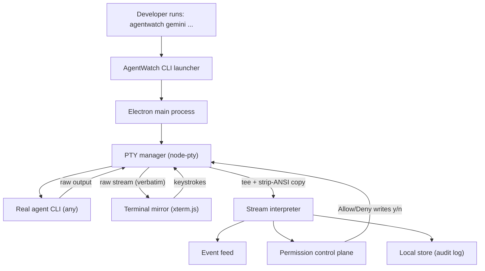

# AgentWatch — Development Plan & Architecture

<aside>
🎯

**What this document is:** the complete, locked development plan for AgentWatch — written *before* any code, so the project is curated step-by-step without the planning/design failures of the last attempt.

**Golden rule (the essence):** *The real terminal already exists. AgentWatch never replaces it — it mirrors it 1:1 and adds one extra layer on top: the words (state annotations + a permission control plane).* Every design decision below defers to this rule.

</aside>

<aside>
📦

**Hand-off brief (read this first).** This document is a complete, self-contained spec for a fresh engineer (or agent) to build AgentWatch from zero. Status: **nothing is built yet — start at Phase 0 (§13).**

- **How to use it:** build **phase by phase** (§8); never start a phase until the previous one's **exit criterion** passes. The hard parts and their solutions are in §4; the non-negotiable **invariants are in §18** — treat those as rules, not suggestions.
- **Companion file:** the visual design is based on the `agentwatch_dashboard_v3.html` mockup — that file must be handed over **alongside** this doc; it is the source of truth for layout and color (formalized in §16).
- **One-sentence definition:** AgentWatch spawns a CLI agent inside a PTY, mirrors its terminal 1:1, and layers state annotations + a permission control plane on top — without ever changing how the agent runs.
</aside>

## 1. Locked decisions

These are settled. We do not revisit them mid-build.

| Decision | Choice | Why it matters |
| --- | --- | --- |
| Platform | Electron desktop app | Cross-platform web UI + Node backend in one process tree; can own a PTY and render a real terminal. |
| OS target | Cross-platform from day one | Forces us to pick only cross-platform primitives (rules out tmux-tapping). |
| Agents supported | Any generic CLI agent | Architecture must be agent-agnostic; agent-specific behavior lives in swappable "profiles". |
| Connection method | PTY wrapper (my recommendation) | Only generic, cross-platform way to mirror any CLI exactly and send input. See §4. |
| v1 scope | Lean MVP — one agent at a time: live mirror + permission gating | Multi-agent switching is deferred to post-MVP. Architecture stays multi-agent-ready. |
| Invocation | <code>agentwatch &lt;command…&gt;</code> (e.g. <code>agentwatch gemini</code>) | Launcher boots the app and spawns the wrapped command inside the PTY. |

## 2. The core mental model

<aside>
🧠

AgentWatch is a **non-intrusive observer + friendly responder**, not a controller.

- It does **not** intercept permissions at the OS level.
- It does **not** pause or proxy the agent — the agent's own prompt blocks while waiting for <code>y/n</code>.
- It **observes** the raw PTY stream, **interprets** it into structured state/events, and **surfaces** a nicer UI to respond to prompts the agent already shows.

If AgentWatch were turned off, the developer would lose the words — but the terminal experience would be identical.

- You launch it **once** (e.g. `agentwatch gemini`): the agent's full interactive session starts, and AgentWatch keeps watching that **same long-lived process — tracked by its PID — across the entire back-and-forth conversation**, until you quit or cancel it.
- In short: it's **a different, friendlier place to launch and watch your agents** — the agent runs and behaves exactly as it always would.
</aside>

## 3. Architecture at a glance



The two arrows out of the PTY are the whole trick: one feeds the **verbatim mirror** (the terminal that already exists), the other feeds a **cleaned copy** to the interpreter (the extra words). They never interfere.

## 4. The hard parts, solved

### 4.1 Mirroring any CLI (the foundation)

- **node-pty** spawns the agent inside a real pseudo-terminal, so the agent behaves exactly as if run directly (colors, spinners, interactivity, resize).
- **xterm.js** in the renderer reproduces the stream byte-for-byte. Keystrokes typed into the mirror flow back to the PTY's stdin — fully interactive, just like the mockup's input row.
- This is the only component that *must* be perfect. If the mirror isn't indistinguishable from the raw terminal, nothing else matters.

### 4.2 Detecting state + permissions for a *generic* agent

Since we support any CLI, we cannot hardcode one agent's format. Instead:

- We tee a **strip-ANSI** copy of the output and run it through a **pattern engine**.
- Patterns live in swappable **Agent Profiles** (regex sets for "reading", "thinking", "writing", "waiting", and "permission prompt").
- Ship a **default/generic profile** plus tuned profiles for Gemini CLI and Claude Code. Unknown agents fall back to the generic profile and still mirror perfectly — they just get fewer annotations.

<aside>
⚠️

This pattern-matching is **best-effort and the #1 risk** (see §7). We accept that annotations are heuristic; the mirror is always exact. Never let annotation logic touch or delay the verbatim stream.

</aside>

### 4.3 Permission gating without intercepting

- When the interpreter matches a permission-prompt pattern, it emits a **pending notification**. The agent is *already* blocked waiting for input — we add no locking of our own.
- Clicking **Allow** writes <code>y\n</code> to the PTY stdin; **Deny** writes <code>n\n</code> (configurable per profile). The verdict is logged to the **Responded / audit** list.
- The developer can also just type <code>y</code> in the mirror as always — both paths work, because we never take the terminal away.

### 4.4 Session lifecycle & PID tracking

The agent is not a one-shot command — it's a long-lived interactive session, and AgentWatch is bound to it for its entire life.

- `agentwatch gemini` is run **once**. With no `-p`, Gemini CLI boots its full **interactive REPL** and stays alive for the whole multi-turn conversation — exactly like running `gemini` directly. (`-p/--prompt` is the one-shot mode; we are NOT using that.)
- The PTY child gets a **PID** the instant it spawns. AgentWatch binds the window/session to that PID and keeps mirroring + interpreting + gating **continuously across every turn** until the process ends.
- It ends only when the process does: you type `/quit`, press Ctrl+C / Ctrl+D, the agent exits on its own, or you close the AgentWatch window (we forward the signal to the PTY).
- On exit we receive a `pty:exit` (code/signal), log "Session ended", mark the agent **Done/closed**, and stop watching that PID. **One agent = one PID = one long-lived window.**
- State is **per-turn within one lifetime**: the badge cycles idle → reading → thinking → writing → waiting → idle many times over, but the PID and the event-feed timeline persist for the entire session.
- **How we get the PID (decided — simplest + most robust):** AgentWatch **spawns the process itself** via the PTY, so it owns the child PID directly from birth. We do not attach to an already-running external terminal (that would mean OS-specific process scraping and we'd lose the clean stdin/stdout pipe). Owning the spawn is cross-platform, gives us exact start/exit signals, and is the only way to reliably mirror + send input.

## 5. Tech stack

| Layer | Choice | Notes |
| --- | --- | --- |
| Shell | Electron + TypeScript | Main (Node) + renderer (web UI); contextBridge/preload for safe IPC. |
| Pseudo-terminal | node-pty | Cross-platform PTY; needs electron-rebuild / prebuilds per OS. |
| Terminal renderer | xterm.js (+ fit/serialize addons) | Byte-accurate mirror, resize handling. |
| UI build | React + Vite (via electron-vite) | Port the v3 mockup into React components; electron-vite wires main / preload / renderer. |
| Stream cleaning | strip-ansi | Only on the tee'd interpreter copy, never the mirror. |
| Persistence | SQLite via better-sqlite3 | Local-first audit log + session history; structured from day one. |
| Packaging | electron-builder | Cross-platform installers; ship the <code>agentwatch</code> bin. |

## 6. Data & event model (sketch)

```tsx
// Emitted by the interpreter, consumed by UI + store
type AgentState = "idle" | "reading" | "thinking" | "writing" | "waiting" | "done";

type FeedEvent = {
  id: string;
  ts: number;
  kind: "session_start" | "session_end" | "state_change" | "permission_needed" | "verdict" | "output";
  state?: AgentState;
  title: string;
  detail?: string;
};

type PendingPermission = {
  id: string;
  ts: number;
  title: string;       // e.g. "Write permission needed"
  source: string;      // agent/profile name
  rawPrompt: string;   // the matched terminal text
  allowInput: string;  // what to send on Allow (default "y\n")
  denyInput: string;   // what to send on Deny  (default "n\n")
};

type Verdict = { permissionId: string; decision: "allow" | "deny"; ts: number };

type AgentProfile = {
  name: string;
  match: { state: Record<AgentState, RegExp[]>; permission: RegExp[] };
  responses: { allow: string; deny: string };
};
```

## 7. Risks & mitigations

| Risk | Severity | Mitigation |
| --- | --- | --- |
| Generic permission/state detection is unreliable | High | Profile system + generic fallback; mirror always works regardless; make patterns user-editable later. |
| node-pty native build breaks across OSes | High | Lock versions, use electron-rebuild in CI, test all 3 OSes early (Phase 1). |
| Interpreter logic slows/garbles the mirror | High | Strict separation: mirror gets the raw stream synchronously; interpreter runs on a tee'd copy, async. |
| ANSI/escape codes confuse pattern matching | Medium | Always strip-ANSI before matching; match on a rolling text buffer, not single chunks. |
| Scope creep into multi-agent before MVP works | Medium | v1 is single-agent. Architecture is multi-ready but UI ships one agent first. |

## 8. Phased roadmap

<aside>
🧭

Each phase has a hard **exit criterion**. We do not start the next phase until the current one passes. This is the discipline that prevents the previous failure.

</aside>

### Phase 0 — Scaffolding

- Goal: a runnable empty Electron app + the <code>agentwatch</code> launcher, on all 3 OSes.
    - [x]  Repo, TypeScript, Vite, Electron main/renderer skeleton
    - [x]  <code>agentwatch &lt;command&gt;</code> bin that boots the app and passes argv
    - [x]  node-pty installed and building via electron-rebuild on macOS / Linux / Windows
    - [x]  Run/dev/build scripts documented
    
    **Exit criterion:** <code>agentwatch echo hello</code> opens the app window on every OS (no mirror yet).
    

### Phase 1 — Faithful terminal mirror (the heart)

- Goal: the mirrored terminal is indistinguishable from running the command directly.
    - [x]  PTY manager spawns the wrapped command, streams output to renderer
    - [x]  xterm.js renders verbatim; colors, spinners, clearing all correct
    - [x]  Keystrokes + paste flow back to PTY stdin (bidirectional)
    - [x]  Window resize → PTY resize
    - [x]  Clean exit / process-end handling
    
    **Exit criterion:** Run <code>agentwatch gemini …</code> and a real agent session is fully usable inside AgentWatch with zero behavioral difference.
    

### Phase 2 — Interpretation layer (the words)

- Goal: structured state + event feed, derived without touching the mirror.
    - [x]  Tee + strip-ANSI rolling buffer
    - [x]  Pattern engine + AgentProfile structure
    - [x]  Generic profile + Gemini + Claude profiles *(generic verified; Gemini/Claude are conservative starter patterns — tune against real transcripts per §21)*
    - [x]  Header status dot/badge reflects current <code>AgentState</code>
    - [x]  Live event feed populates from real output
    - [x]  **Dual-mirror passthrough:** the same single PTY also drives the **native terminal** that launched <code>agentwatch</code> (output to both the native terminal and the GUI mirror; input usable from either), **agent-agnostic** and with **no second process / no double compute**. The native terminal is the size authority when attached; gracefully GUI-only when there is no controlling TTY (e.g. a packaged double-click launch).
    
    **Exit criterion:** During a real session, state badge and event feed update sensibly while the mirror stays byte-perfect, **and** the agent is simultaneously usable from both the native terminal and the GUI mirror with a single underlying process.
    

### Phase 3 — Permission control plane

- Goal: the Allow/Deny loop works end-to-end against a real agent.
    - [ ]  Detect permission prompts → create pending notification
    - [ ]  Allow/Deny writes correct input to PTY stdin
    - [ ]  Verdict moves item to Responded tab + logs it
    - [ ]  Manual typing in the mirror still works as fallback
    
    **Exit criterion:** A real agent's permission prompt can be answered from the UI and the session continues correctly.
    

### Phase 4 — Persistence, polish & packaging

- Goal: a shippable, good-looking local-first MVP.
    - [ ]  Local store for audit log + session history
    - [ ]  Port v3 CSS/theme into the renderer properly
    - [ ]  Settings (profiles, default responses)
    - [ ]  Error/edge-case handling, empty states
    - [ ]  electron-builder installers for all 3 OSes
    
    **Exit criterion:** A fresh machine can install AgentWatch and run a full annotated, gated session.
    

### Phase 5 — Post-MVP (deferred)

- Explicitly NOT in v1 — parked here so we don't drift.
    - [x]  Multi-agent switching + multiple concurrent PTYs *(pulled forward — see §28)*
    - [x]  Search (filter agents by CLI name) *(pulled forward — see §28)*
    - [ ]  User-editable profiles / pattern UI
    - [ ]  Session replay, export
    - [ ]  Remote/headless watching

## 28. Multi-agent + dual-mirror relay (pulled forward)

Delivered ahead of schedule on user request: one window shows **all** running
agents (left sidebar, searchable, click to switch) while every agent still
mirrors in the **native terminal** that launched it.

- **Relay launcher.** `agentwatch <cli>` no longer opens its own window. It
  connects to a single **primary** Electron app over a local socket
  (`bin/agentwatch.js` ⇄ `src/main/ipcServer.ts`, framed by
  `src/shared/protocol.ts`) and acts as a byte relay: native-terminal stdin →
  PTY, PTY output → native terminal. One agent spawn, no double compute.
- **SessionManager** (`src/main/sessionManager.ts`) owns many sessions, each one
  PTY + interpreter + profile. A session can have several viewers (the relay and
  the GUI); the PTY size is the **min across viewers**, so neither view overflows.
- **Renderer** keeps one live xterm per session (instant switching + full
  scrollback) via an imperative `TerminalManager`; output never enters React.
- **Universal palette** centralized in `src/renderer/src/theme.ts` + the CSS
  tokens, shared by the chrome and the xterm theme.

**Bug fixes shipped alongside:** terminal scroll/overflow and the missing
typed-text/cursor glitch (both caused by GUI↔native size mismatch — fixed by min
size negotiation); the event feed now names the file being read/written
(interpreter file extraction).

## 9. Resolved decisions

These were the open questions — now settled.

| Question | Decision | Implication |
| --- | --- | --- |
| Persistence | SQLite (better-sqlite3) | Structured audit log + session history from the start; also a chance to learn something new. |
| Renderer UI framework | React | Component-based port of the v3 mockup; the terminal stays imperative (xterm) inside a thin React wrapper. |
| Windowing model | One window per agent + dropdown switcher | Each agent session is its own window/PTY; the topbar dropdown switches between them. v1 ships one agent (one window) but is built window-per-agent ready. |

## 10. Repo & folder structure

A single Electron app, organized so the **mirror** and the **words** never bleed into each other.

```
agentwatch/
├─ package.json
├─ electron.vite.config.ts        # electron-vite: main / preload / renderer
├─ tsconfig.json
├─ bin/
│  └─ agentwatch.js               # the `agentwatch <cmd>` CLI launcher
├─ src/
│  ├─ main/                       # Electron main process (Node)
│  │  ├─ index.ts                 # app lifecycle, window creation
│  │  ├─ pty/ptyManager.ts        # node-pty wrapper (spawn, data, resize, kill)
│  │  ├─ interpreter/             # cleaned stream -> state + events
│  │  │  ├─ interpreter.ts
│  │  │  └─ profiles/             # AgentProfile regex sets
│  │  ├─ store/db.ts              # SQLite (better-sqlite3) audit log
│  │  └─ ipc/handlers.ts          # IPC channel wiring
│  ├─ preload/index.ts            # contextBridge: safe API to the renderer
│  └─ renderer/                   # React UI
│     ├─ App.tsx
│     ├─ components/              # Topbar, AgentCard, EventFeed, Notifications...
│     ├─ hooks/                   # useAgentStream, useNotifications...
│     └─ state/                   # zustand store
└─ resources/                     # icons, packaged assets
```

## 11. Process model & IPC contract

Electron has two sides: the **main process** (Node — owns the PTY, interpreter, and SQLite) and the **renderer** (React UI). They never share memory; they talk over a small, explicit set of IPC channels exposed safely through a **preload** bridge (contextBridge). Locking this contract down now is what keeps the codebase from tangling later.

| Channel | Direction | Payload | Purpose |
| --- | --- | --- | --- |
| `pty:data` | main → renderer | raw chunk (string) | Feed verbatim output into xterm. |
| `pty:input` | renderer → main | string | Keystrokes / paste → PTY stdin. |
| `pty:resize` | renderer → main | { cols, rows } | Keep PTY size synced to the view. |
| `pty:exit` | main → renderer | { code, signal } | Session ended. |
| `agent:state` | main → renderer | AgentState | Drive the header dot + badge. |
| `feed:event` | main → renderer | FeedEvent | Append to the event feed. |
| `permission:pending` | main → renderer | PendingPermission | Surface a pending notification. |
| `permission:respond` | renderer → main | { id, decision } | Allow/Deny → write to PTY + log verdict. |
| `history:query` | renderer ⇄ main | filters / rows | Read the audit log from SQLite. |

## 12. React component map

The v3 mockup maps almost one-to-one onto React components.

```
App
├─ Topbar
│  ├─ Logo + app name
│  ├─ AgentSwitcher (dropdown)     <- switches between agent windows
│  └─ StatusBadges (watching · pending · agent count)
├─ Layout (split)
│  ├─ LeftCol
│  │  └─ AgentCard
│  │     ├─ AgentHeader (dot, name, pid, status badge)
│  │     ├─ TerminalMirror         <- imperative xterm.js host (ref-mounted)
│  │     └─ TerminalInputRow (inject command)
│  └─ RightCol
│     ├─ EventFeed (FeedEvent list)
│     └─ NotificationPanel
│        ├─ Tabs (Pending | Responded)
│        ├─ PendingList -> PendingCard (Allow / Deny)
│        └─ RespondedList -> RespondedCard (verdict + time)
```

<aside>
⚠️

**xterm.js lives outside React's render cycle.** Mount it once into a ref and push `pty:data` straight into `term.write()`. Never map terminal output into React state — re-rendering on every chunk would destroy both performance and the byte-perfect mirror.

</aside>

**Windowing:** each agent session is its own browser window backed by its own PTY; the AgentSwitcher dropdown raises/focuses the chosen one. v1 ships a single agent (one window), but the model is window-per-agent from the start.

## 13. Phase 0 — detailed walkthrough (our next move)

The exact ordered steps we'll take once you say go. Nothing here runs yet.

1. **Prereqs** — confirm Node LTS (`node -v`) and Git are installed.
2. **Scaffold** — create the project from the electron-vite **React + TypeScript** template.
3. **Install deps** — `node-pty`, `@xterm/xterm`, `@xterm/addon-fit`, `better-sqlite3`, `strip-ansi`, `zustand`.
4. **Native modules** — set up `electron-rebuild` so `node-pty` and `better-sqlite3` compile against Electron's ABI (the usual cross-platform pain point — handled on day one).
5. **CLI launcher** — add `bin/agentwatch.js`, register it under `package.json` → `bin`, and have it collect argv and boot the app.
6. **argv → main** — main reads the wrapped command and simply logs it (no spawning yet).
7. **Smoke test** — run `agentwatch echo hello`; the window should open on your OS.

<aside>
✅

**Phase 0 exit criterion:** `agentwatch echo hello` opens the AgentWatch window — no mirror, no PTY spawn yet. That's the entire bar for Phase 0.

</aside>

## 14. Testing & verification strategy

Every phase is proven before we advance — this is the anti-failure mechanism.

- **Mirror parity (Phase 1):** run `agentwatch bash`, then exercise `vim`, `htop`, `Ctrl-C`, colors, and resize. It must feel identical to a raw terminal.
- **Interpreter golden tests (Phase 2):** record real session transcripts and assert the interpreter emits the expected states/events — fast, deterministic, no live agent needed.
- **Permission loop (Phase 3):** write a tiny fake script that prints `Allow? (y/n)` and waits; verify Allow/Deny drives it correctly.
- **Cross-platform CI:** build + smoke-test on macOS, Linux, and Windows so native modules never silently break.

## 15. Glossary

| Term | Meaning |
| --- | --- |
| PTY | Pseudo-terminal — lets us run a CLI as if it had a real terminal attached. |
| Mirror | The verbatim, byte-for-byte reproduction of the agent's terminal in the UI. |
| Tee | Splitting the output stream into two copies — one for the mirror, one (cleaned) for the interpreter. |
| Interpreter | The layer that turns cleaned output into structured states and events (the "words"). |
| Profile | A swappable set of regex patterns describing how a given agent signals state and permission prompts. |
| Control plane | The notification panel where pending permissions are answered and verdicts are logged. |

## 16. UI design system

The v3 HTML is the canonical look — we keep its DNA and level it up into a real, tokenized design system with proper fonts, accessibility, and dark-mode parity.

### 16.1 Design principles

- **The terminal is the hero.** Dark, high-contrast, monospace, full height. Everything else stays calm and recedes.
- **Color means state, nothing else.** Blue = reading/waiting, amber = thinking, green = writing/done/allowed, red = denied. No decorative color.
- **Hairline, Notion-native chrome.** 0.5px borders, soft surfaces, generous radius, almost no shadow.
- **The words never shout over the terminal.** Annotations and badges are small, quiet pills.

### 16.2 Color tokens

Standalone-app values (the mockup borrowed Notion's CSS vars; here they're pinned). Light theme shown; dark theme swaps surfaces/text and keeps the terminal + semantic palette identical.

| Token | Hex | Use |
| --- | --- | --- |
| Accent / Iris | #7F77DD | Logo dot, terminal prompt, active tab, cursor, focus ring. |
| Surface 1 | #FFFFFF | Panels, cards. |
| Surface 2 | #F7F7F5 | Headers, inputs, hover. |
| Border | #EBEBEA | Hairline 0.5px dividers. |
| Text 1 | #191919 | Primary text. |
| Text 2 | #787774 | Secondary / labels / timestamps. |

**Terminal surface (always dark, both themes):**

| Token | Hex | Use |
| --- | --- | --- |
| Terminal bg | #0F1117 | The mirror background. |
| Prompt | #7F77DD | Prompt glyph. |
| Command | #C8C8D0 | Typed / echoed commands. |
| Output | #9FE1CB | Success / normal output. |
| Dim | #555566 | Context, meta, planning lines. |
| Warn | #EF9F27 | Warnings + permission requests. |

**Semantic state palette (badge bg / text / dot):**

| State | Badge bg | Text | Dot |
| --- | --- | --- | --- |
| Reading / Waiting | #E6F1FB | #185FA5 | #378ADD |
| Thinking | #FAEEDA | #854F0B | #EF9F27 |
| Writing / Done / Allowed | #E1F5EE | #0F6E56 | #1D9E75 |
| Denied / Error | #FCEBEB | #A32D2D | #E24B4A |
| Idle / Neutral | #F7F7F5 | #787774 | #B9B9B7 |

### 16.3 Typography

The mockup leaned on the host's fonts; the app ships its own so it looks identical everywhere.

| Role | Family | Size / weight |
| --- | --- | --- |
| UI sans | Inter (fallback: system-ui, -apple-system, Segoe UI) | 13px / 400–500 |
| Monospace (terminal) | JetBrains Mono (fallback: SF Mono, Cascadia Code, Menlo, Consolas) | 12px / 400, line-height 1.75 |
| Labels / meta | Inter | 11px / 500 |
| Section titles | Inter | 12–13px / 500–600 |
| State pills + badges | Inter | 10–11px / 500 |

### 16.4 Spacing, radius & elevation

- **Spacing scale:** 4 · 6 · 8 · 10 · 13 · 14 px (panel padding lands on 9–13).
- **Radius:** sm 6 · md 8 · lg 12 px.
- **Borders:** 0.5px hairlines everywhere; pending notifications get a 2px info-blue border to draw the eye.
- **Elevation:** essentially flat — separation comes from borders + surface tints, not shadow.

### 16.5 Layout & grid

```
+-- Topbar ----------------------------------------------------+
|  AgentWatch     [Agent: Gemini CLI v]    Watching  1 pending |
+----------------------------------+---------------------------+
|  Gemini CLI  pid 48291 [Waiting] | Event feed          live  |
|  +-----------------------------+ | * Permission needed   now |
|  | $ gemini -p "refactor..."   | | * Thinking           0:12 |
|  | + Reading: login.js [read]  | | * Reading files      0:25 |
|  | Analyzing...     [thinking] | +---------------------------+
|  | ! Requesting write  [wait]  | | Notifications             |
|  | Allow? (y/n) _              | | [Pending 1][Responded 2]  |
|  +-----------------------------+ | * Write permission needed |
|  $ inject command...  [ send ]  |   [ Allow ]   [ Deny ]     |
+----------------------------------+---------------------------+
```

- **Topbar:** full-width; logo + app name left, agent dropdown center, status badges right.
- **Split grid:** ~1.55fr terminal / ~0.95fr panels, right column min 320px.
- **Left:** AgentCard fills height (min-height ~ viewport − 124px); terminal flexes, input row pinned at bottom.
- **Right:** Event feed (capped ~310px, scrolls) above the Notifications panel (tabbed, flexes).
- **Responsive:** below 1024px the grid stacks to one column; terminal gets a fixed tall height.

### 16.6 Component specs (from the mockup, refined)

- **Agent switcher:** pill dropdown, Surface 2, hairline border; lists running agent windows.
- **Status badges (topbar):** Watching (green), N pending (amber), N agents (neutral).
- **Agent header:** state dot (pulses when active) + name + monospace pid + state badge.
- **State annotations:** tiny right-aligned pills on terminal lines (reading, thinking, writing, waiting, done).
- **Input row:** dark, monospace, prompt prefix + free input + send; injects straight into the PTY.
- **Event feed item:** colored icon + title + one-line detail + monospace timestamp.
- **Notification tabs:** Pending / Responded with count chips.
- **Pending card:** info-blue 2px border, header (icon + title + source), monospace request body, Allow (solid green) / Deny (ghost) buttons.
- **Responded card:** check/cross icon + label + verdict chip (Allowed green / Denied red) + time.
- **Empty states:** quiet centered secondary text ("No pending notifications.").

### 16.7 Motion

- Active state dots + the live indicator **pulse** (1.2–1.5s).
- Terminal cursor **blinks** (1s step).
- Hover/tab changes transition ~150ms.
- New events + pending cards **fade/slide in** so changes are noticed without jarring.

### 16.8 What we improve over v3 (same identity, leveled up)

- **Real token system + true dark mode** (terminal already dark; panels gain a dark variant).
- **Bundled fonts** (Inter + JetBrains Mono) so it looks identical on every OS.
- **Accessibility:** WCAG AA contrast, visible focus rings, live-region announcements on the event feed + pending list, screen-reader labels on Allow/Deny.
- **Keyboard-first:** Y/N answer the focused permission, a shortcut to jump to the live prompt, and Cmd/Ctrl+K to switch agents.
- **Draggable split divider** + density toggle (comfortable / compact).
- **Attention cues:** subtle flash + optional sound + window-badge when a new permission lands.
- **Terminal niceties:** search, copy, and a "jump to prompt" affordance — without ever altering the verbatim stream.

## 17. Demo run example

A concrete end-to-end session showing the **long-lived, interactive** nature. You launch it **once** and keep chatting back-and-forth until you quit. Command: `agentwatch gemini` — plain `gemini` opens the interactive REPL (`-p/--prompt` would be one-shot, which we do NOT use).

<aside>
🔁

One launch = one persistent process = **one PID (48291)** that stays alive across every turn below. AgentWatch keeps mirroring, annotating, and gating that *same* PID the whole time, and only stops when the process exits or is cancelled.

</aside>

| t | What happens (real terminal) | What AgentWatch shows (the words) | State badge |
| --- | --- | --- | --- |
| launch | `agentwatch gemini` boots the full Gemini CLI REPL — banner, model line, then a blinking `>` prompt waiting for you. | Topbar: Watching · Gemini CLI · pid 48291. Event: "Session started (pid 48291)". | Idle (awaiting input) |
| Turn 1 | At the `>` prompt you type "refactor the auth module". The agent reads files, thinks, then prints `Allow write to src/auth/login.js? (y/n)` and blocks. | Badge cycles Reading → Thinking → Waiting. Pending card: "Write permission needed · Gemini CLI"; topbar shows 1 pending. | Reading → Thinking → Waiting |
| Turn 1 · allow | You click **Allow** → AgentWatch sends `y` then Enter to the PTY. The agent writes the files, prints "Done", and returns to the `>` prompt. | Verdict logged to Responded (Allowed). Event: "Allowed: write auth files". | Writing → Idle |
| Turn 2 | **Same session, still pid 48291.** You type "now add tests for it". Context is retained; the agent reads, thinks, and writes test files. | Feed appends Turn 2 under the same timeline. The PID never changes; the window stays bound to it. | Reading → Thinking → Writing → Idle |
| … more turns | You keep chatting as long as you like — every turn flows through the same live process. | AgentWatch watches continuously; the audit log grows across the whole session. | cycles per turn |
| end | You type `/quit` (or press Ctrl+C, or close the window). The Gemini CLI process exits. | `pty:exit` fires. Event: "Session ended (pid 48291)". AgentWatch stops watching that agent. | Done / closed |

<aside>
🎯

**What this demo proves about the project's definition:** the real terminal ran exactly as it always would — we never touched its bytes. AgentWatch only (1) **mirrored** it verbatim, (2) layered **words** (state pills + event feed) on top, and (3) let you answer the agent's *own* blocking prompt from a friendlier surface, then **logged the verdict** for audit. Turn AgentWatch off and that same session still runs identically in a plain terminal.

</aside>

## 18. Engineering invariants (non-negotiables)

These are the rules that protect the essence. Breaking any one of them breaks the project.

- **The mirror is sacred.** Raw PTY bytes go to xterm.js **synchronously and unmodified**. Annotation/interpreter logic must never mutate, delay, buffer, or reorder the mirror stream.
- **Interpretation runs on a copy only.** The interpreter consumes a tee'd, strip-ANSI'd duplicate. If it throws, the mirror must keep working untouched.
- **Never put terminal output in React state.** xterm is mounted once via a ref; push `pty:data` straight into `term.write()`.
- **No OS-level interception.** The agent's own prompt does the blocking; Allow/Deny only writes bytes to stdin. We never proxy, sandbox, or pause the process.
- **One agent = one PID = one window.** We always own the spawn (see §4.4).
- **One process, many mirrors.** The agent is spawned exactly **once** (one PTY, no double compute). Its single raw stream may be teed to multiple faithful sinks — the xterm GUI mirror **and** the native terminal that launched <code>agentwatch</code> — and may accept input from any of them. This passthrough is byte-level and **agent-agnostic**; never spawn the CLI twice to feed a second view.
- **All main↔renderer traffic goes through the typed preload bridge (§22).** `contextIsolation: true`, `nodeIntegration: false`. Nothing else crosses.
- **Profiles are heuristic and degrade gracefully.** A missing pattern means "fewer words," never a broken terminal.
- **Phases are gated.** Do not start a phase until the prior exit criterion (§8) passes.

## 19. Prerequisites & pinned versions

Starting versions — pin exact values in the lockfile on first install.

| Dependency | Version | Role |
| --- | --- | --- |
| Node.js | 20.x LTS | Runtime + build toolchain. |
| Electron | ^31 | Desktop shell (main + renderer). |
| electron-vite | latest | Dev/build wiring for main/preload/renderer. |
| node-pty | ^1.0 | Spawns the agent in a PTY (native). |
| @xterm/xterm | ^5.5 | Terminal mirror. |
| @xterm/addon-fit | ^0.10 | Fit terminal to container on resize. |
| better-sqlite3 | ^11 | Local audit store (native). |
| strip-ansi | ^7 | Clean the interpreter copy. |
| zustand | ^4 | Renderer state. |
| electron-rebuild | latest | Rebuild native modules against Electron ABI. |
| electron-builder | ^24 | Cross-platform installers. |
| Native toolchain | Python 3 + C/C++ (Xcode / MSVC Build Tools / build-essential) | Required to compile node-pty + better-sqlite3. |

## 20. Key implementation sketches

Reference shape only — not final code. They exist so the implementer doesn't reinvent the contract.

**PTY manager (main):**

```tsx
import * as pty from "node-pty";

export function spawnAgent(cmd: string, args: string[], cwd: string) {
  const shell = pty.spawn(cmd, args, {
    name: "xterm-color",
    cols: 80,
    rows: 30,
    cwd,
    env: process.env,
  });

  shell.onData((data) => {
    send("pty:data", data);   // 1) verbatim -> mirror (synchronous, untouched)
    interpreter.feed(data);   // 2) tee -> interpreter (strips ANSI internally)
  });

  shell.onExit(({ exitCode, signal }) =>
    send("pty:exit", { code: exitCode, signal }),
  );

  return shell; // shell.pid is our session identity
}

// renderer -> main
on("pty:input",  (d) => shell.write(d));
on("pty:resize", ({ cols, rows }) => shell.resize(cols, rows));
on("permission:respond", ({ id, decision }) =>
  shell.write(decision === "allow" ? profile.responses.allow : profile.responses.deny),
);
```

**Interpreter (rolling buffer, main):**

```tsx
import stripAnsi from "strip-ansi";

class Interpreter {
  private buf = "";
  constructor(private profile: AgentProfile, private emit: Emit) {}

  feed(chunk: string) {
    // keep a bounded tail so memory never grows; lines may arrive split
    this.buf = (this.buf + stripAnsi(chunk)).slice(-8192);

    for (const line of this.buf.split("\n")) this.classify(line);

    // permission prompts can span the buffer, so test the whole tail
    for (const re of this.profile.match.permission) {
      if (re.test(this.buf)) this.emit.permission(this.buf);
    }
  }

  private classify(line: string) {
    // most-specific-wins order is enforced by the caller (see §21)
    for (const [state, regs] of Object.entries(this.profile.match.state)) {
      if (regs.some((r) => r.test(line))) this.emit.state(state as AgentState);
    }
  }
}
```

## 21. Agent Profile reference (concrete)

The #1 risk lives here, so v1 ships a **generic** profile plus tuned Gemini/Claude profiles. Match on the strip-ANSI rolling buffer; resolve with **most-specific-wins** priority: `permission > waiting > writing > thinking > reading > done > idle`.

```tsx
const genericProfile: AgentProfile = {
  name: "generic",
  match: {
    state: {
      idle:     [/^\s*[>$#]\s*$/],
      reading:  [/\b(reading|opening|loading|scanning)\b/i],
      thinking: [/\b(thinking|analy[sz]ing|planning|reasoning)\b/i],
      writing:  [/\b(writing|editing|creating|patch(ing)?|applying)\b/i],
      waiting:  [/\?\s*\(y\/n\)/i, /\bpress\b.*\bto continue\b/i],
      done:     [/\b(done|complete|finished|success)\b/i],
    },
    permission: [/allow\b.*\?\s*\(y\/n\)/i, /do you want to (allow|proceed)/i],
  },
  responses: { allow: "y\n", deny: "n\n" },
};
```

<aside>
⚠️

**Do not guess the Gemini/Claude regexes.** In Phase 2, record real session transcripts first, then write patterns against them. Guessing is exactly what sank the previous attempt.

</aside>

## 22. Preload API contract

The only surface that crosses from main to the React renderer. Exposed on `window.agentwatch` via `contextBridge`.

```tsx
// types FeedEvent / PendingPermission / AgentState are defined in §6
export interface AgentWatchApi {
  // mirror
  onData(cb: (chunk: string) => void): () => void; // returns unsubscribe
  sendInput(data: string): void;
  resize(cols: number, rows: number): void;
  onExit(cb: (info: { code: number; signal?: number }) => void): () => void;

  // the words
  onState(cb: (s: AgentState) => void): () => void;
  onEvent(cb: (e: FeedEvent) => void): () => void;

  // permission control plane
  onPermission(cb: (p: PendingPermission) => void): () => void;
  respondPermission(id: string, decision: "allow" | "deny"): void;

  // audit log
  queryHistory(filter: HistoryFilter): Promise<HistoryRow[]>;
}
```

**Security:** `contextIsolation: true`, `nodeIntegration: false`, sandbox where feasible. The renderer never touches Node, the PTY, or SQLite directly — only this API.

## 23. SQLite schema (audit log)

Local-first, structured from day one. Timestamps are epoch milliseconds.

```sql
CREATE TABLE sessions (
  id         INTEGER PRIMARY KEY,
  pid        INTEGER NOT NULL,
  command    TEXT    NOT NULL,
  profile    TEXT,
  started_at INTEGER NOT NULL,
  ended_at   INTEGER,
  exit_code  INTEGER
);

CREATE TABLE events (
  id         INTEGER PRIMARY KEY,
  session_id INTEGER NOT NULL REFERENCES sessions(id),
  ts         INTEGER NOT NULL,
  kind       TEXT    NOT NULL,   -- matches FeedEvent.kind
  state      TEXT,
  title      TEXT    NOT NULL,
  detail     TEXT
);

CREATE TABLE verdicts (
  id            INTEGER PRIMARY KEY,
  session_id    INTEGER NOT NULL REFERENCES sessions(id),
  permission_id TEXT    NOT NULL,
  raw_prompt    TEXT,
  decision      TEXT    NOT NULL,  -- 'allow' | 'deny'
  ts            INTEGER NOT NULL
);

CREATE INDEX idx_events_session   ON events(session_id, ts);
CREATE INDEX idx_verdicts_session ON verdicts(session_id, ts);
```

## 24. npm scripts & commands

```bash
npm run dev        # electron-vite dev (HMR for renderer + main)
npm run build      # type-check + bundle main / preload / renderer
npm run rebuild    # electron-rebuild native modules (node-pty, better-sqlite3)
npm run package    # electron-builder -> platform installers
npm link           # expose the `agentwatch` bin locally for testing
```

## 25. Edge cases & platform notes

- **Windows:** node-pty uses ConPTY; test CRLF handling, resize, and Ctrl+C separately from Unix.
- **Agent never prompts:** state simply stays in its last detected value — acceptable.
- **Rapid back-to-back prompts:** queue pending items; only the top one is "live." Respond in order; each respond writes to the agent's current prompt.
- **Agent exits while a permission is pending:** on `pty:exit`, clear pending items and mark the session ended.
- **Huge/fast output:** xterm handles rendering; the interpreter keeps only a bounded tail buffer so memory never grows.
- **ANSI / progress bars / cursor moves:** always strip-ANSI before matching, and match on the rolling buffer (not a single chunk) because lines arrive split.
- **Sensitive output:** the audit log stores text; redaction/opt-out is a Phase 5 concern — note it but don't block v1.

## 26. Assumptions & open questions for the implementer

- **Assumption:** the wrapped agent prints its permission prompt to stdout/stderr and reads `y`/`n` from stdin (true for Gemini CLI and Claude Code). A GUI/keypress-only prompt would need a profile tweak.
- **Assumption:** default working directory is wherever `agentwatch` was invoked.
- **Assumption:** v1 ships a single window; the window-per-agent + dropdown model is wired but multi-agent is not required to ship.
- **Open:** exact Gemini/Claude permission + state regexes — capture from real transcripts in Phase 2 (see §21).
- **Open:** persist full raw transcript, or only events + verdicts? Default for v1: **events + verdicts only**; raw transcript optional/off.
- **Open:** packaged-app distribution (code signing/notarization) is out of scope until after the MVP runs locally.

## 27. Immediate next step

<aside>
▶️

We start at **Phase 0 — Scaffolding**, and only move on once <code>agentwatch echo hello</code> opens the window on your OS.

Nothing has been built yet. When you're ready, tell me to begin Phase 0 and I'll guide you through it one concrete step at a time.

</aside>